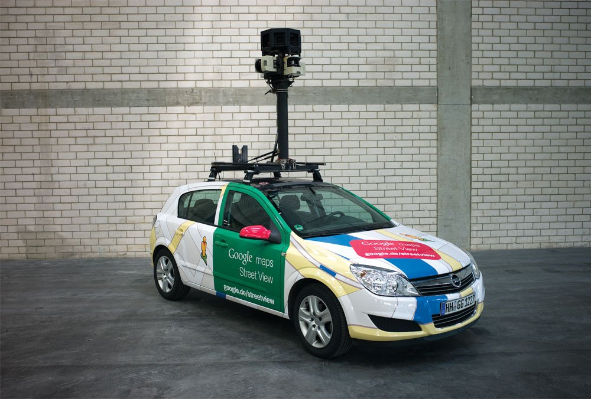

>Hash Code is a team programming competition organized by Google for students and industry professionals across Europe, the Middle East and Africa. You pick your team and programming language, we pick a Google engineering problem for you to solve.
The competition takes place over two rounds:

## Online Qualification Round

Your team can participate from one of our competition hubs or from wherever else you’d like.

## Final Round
Top scoring teams from the Online Qualification Round will be invited to Google Dublin to compete in the Final Round of the competition.

# Editions

## 2018

TBD

## 2017

## 2016

## 2015

## 2014

### Street View routing
_Hash Code 2014, Final Round_

The Street View imagery available in Google Maps is captured using specialized vehicles called Street View cars. These cars carry multiple cameras capturing pictures as the car moves around a city. Capturing the imagery of a city poses an optimization problem: the fleet of cars is available for a limited amount of time and we want to cover as much of the city streets as possible.

[:notebook:](2014/hashcode2014_final_task.pdf) / [:page_facing_up:](:page_facing_u) / [:raised_hands:]()
